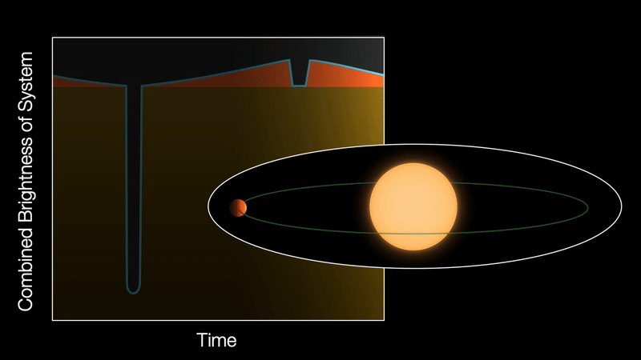

# Overview
This was the final project for Dr. Meghan Chiovaro's ELE391 Introduction to ML Class at The University of Rhode Island.  This project includes a full pipeline from sourcing raw lightcurve data from NASA's Kepler and K2 Missions, data processing, and training a CNN-based exoplanet classifier.

